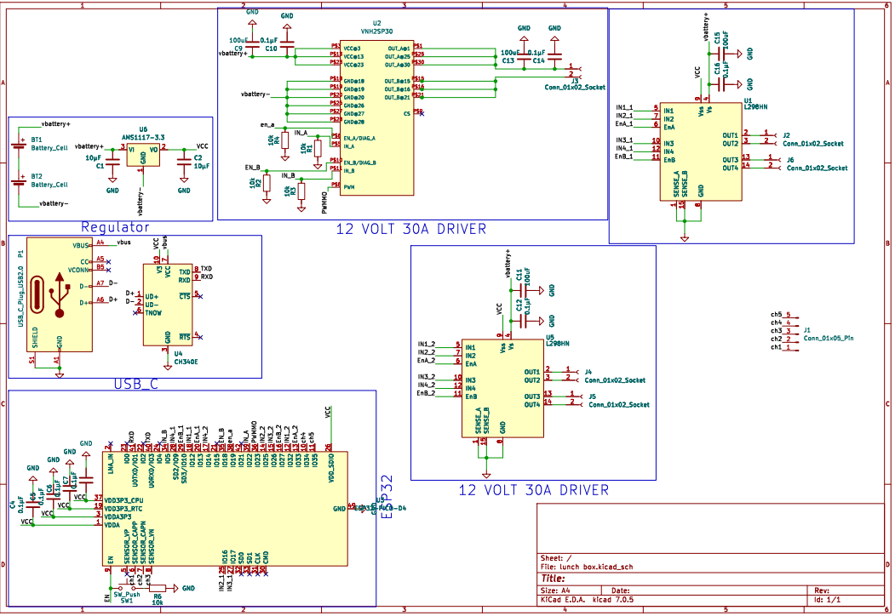

# battlebot-MNH-V01

## Table of Contents
1. [Introduction](#introduction)
2. [Design Overview](#design-overview)
3. [Weight and Dimensions](#weight-and-dimensions)
4. [Frame Construction](#frame-construction)
5. [tool System](#tool-system)
6. [Electrical Components](#electrical-components)
7. [PCB Design](#pcb-design)
8. [References](#references)

## Introduction
The "battlebot-MNH-V01" is a custom-built battle bot designed for high performance in competitive environments. This bot combines precision engineering and robust construction to achieve high mobility and effective combat capabilities.


## Design Overview
### Frame Construction
- **Material:** Aluminum
- **Construction:** The frame serves as the skeleton, providing a sturdy yet lightweight base. It includes reinforcements at critical stress points to prevent deformation during combat.
- **Benefits:** The use of aluminum and 3D-printed components allows for rapid prototyping and customization, ensuring flexibility and cost-effectiveness.


### Weight and Dimensions
- **Total Weight:** 3 kg
- **Overall Dimensions:** 21 cm x 20 cm

## Tool System
### Integration
- **Primary Weapon:** A centrally mounted spinning blade made from hardened steel.
- **Motor:** High-torque electric motor.
- **Specifications:**
  - **Spin Rate:** Up to 5000 RPM
  - **Impact Resistance:** Designed for high durability and easy field repairs.


## Electrical Components
### Key Components
- **DC Motor:** High Speed Electric Brush Motor (12V, 100W, 5000RPM)
- **Transmitter:** GoolRC Flysky FS-i6X Transmitter with FS-iA6B Receiver
- **Battery:** CNHL 2200mAh 3S Lipo Battery (30C, 11.1V)
- **Wheels:** Premium 97mm Mecanum Wheels
- **Controller:** ESP32-PICO-D4 microcontroller for managing motor and sensor inputs.

### Motor Drivers
- **Wheel Motors:** Dual L298HN Motor Drivers
- **Weapon Motor:** VNH2SP30 Motor Driver

## PCB Design
### Overview
The PCB (Printed Circuit Board) for the battle bot is designed to control all major functions, including motor control and sensor integration. The design focuses on robustness, efficiency, and ease of maintenance, ensuring optimal performance during competitions.

### Size and Layers
- **Dimensions:** 10 cm x 9.5 cm
- **Layers:** 2-layer design for efficient routing of power and signal traces.


### Trace Widths
- **Motor Traces:** 0.8 mm (for currents up to 2A)
- **Tool  Motor Traces:** 2.5 mm (for currents up to 10A)
- **Design Standards:** Trace widths are calculated based on IPC-2221 standards to handle the expected current loads with an allowable temperature rise of 10°C to 20°C.

### Key Components
- **Microcontroller (U3):** ESP32-PICO-D4
  - **Function:** Central processing unit that handles control logic, motor commands, and sensor inputs.
  - **Power Supply:** 3.3V provided by AMS1117-3.3 voltage regulator.
- **Motor Drivers:**
  - **L298HN (U1, U5):** Controls the four wheel motors, allowing precise movement and speed adjustments.
  - **VNH2SP30 (U2):** Manages the high-current weapon motor, providing necessary torque and speed.
- **Voltage Regulator (U6):** AMS1117-3.3
  - **Function:** Provides stable 3.3V output for low-power devices.
  - **Current Handling:** Up to 1A, supporting the microcontroller and sensors.
- **USB to Serial Converter (U4):** CH340E
  - **Function:** Enables programming and communication between the microcontroller and a computer.
- **Capacitors (C1, C10-C16):** Stabilize voltage and filter noise in the power supply.
- **Resistors (R1, R2, R3, R4, R6):** Employed for pulling up/down inputs and limiting current to protect other components.
- **Connectors (J1, J2, J3, J4, J5, J6):** Provide interfaces for external connections to motors, power sources, and other peripherals.
- **Switch (SW1):** Used to enable the microcontroller, typically controlling the power state or activation of the system.



### Power Management
- **AMS1117-3.3 Voltage Regulator (U6):**
  - **Function:** Provides a stable 3.3V output for low-power devices.
  - **Current Handling:** Up to 1A.
  - **Integration:** Positioned near power inputs with filtering capacitors to ensure smooth operation.
- **VNH2SP30 Motor Driver:**
  - **Function:** Drives the weapon motor.
  - **Current Handling:** 30A continuous.
  - **Integration:** Includes extensive heat sinking to manage high current loads.
- **Dual L298HN Motor Drivers:**
  - **Function:** Independently controls four wheel motors.
  - **Current Handling:** 2A per channel.
  - **Integration:** Equipped with dedicated capacitors for voltage stabilization and noise filtering.

### Layout and Design Considerations
- **Trace Width:** Motor traces are designed to handle high currents without excessive heat buildup or voltage drop.
- **Via Optimization:** Used to connect traces between the top and bottom layers, enhancing electrical performance.
- **Accessibility:** All connectors and critical components are easily accessible for maintenance and troubleshooting.


## Code Example
```cpp
#include <ESP32Servo.h>
#include <FlySkyIBus.h>

// Motor driver pin definitions
const int enA1Pin = 13; // PWM channel 0
const int in1_1Pin = 12;
const int in2_1Pin = 16;
const int enB1Pin = 10; // PWM channel 1
const int in3_1Pin = 17;
const int in4_1Pin = 9;

const int enA2Pin = 33; // PWM channel 2
const int in1_2Pin = 32;
const int in2_2Pin = 25;
const int enB2Pin = 27; // PWM channel 3
const int in3_2Pin = 26;
const int in4_2Pin = 14;

const int enBPin = 35; // PWM channel 4
const int inBPin = 5;
const int inAPin = 22;
const int pwmPin = 23;  // PWM channel 5

// Gun motor pin definition
const int gunMotorPin = 19; // PWM channel 6

// Enable switch pin definition
const int enableSwitchPin = 9;

// PWM frequency and resolution
const int pwmFreq = 5000;
const int pwmResolution = 8;

// Receiver channel mappings
const int ch1 = 0; // Throttle
const int ch2 = 1; // Steering
const int ch3 = 2; // Strafing
const int ch4 = 3; // Rotation
const int ch5 = 4; // Gun control

void setup() {
  // Initialize serial communication
  Serial.begin(115200);
  IBus.begin(Serial1, 115200);
  
  // Set up PWM channels
  ledcSetup(0, pwmFreq, pwmResolution);
  ledcSetup(1, pwmFreq, pwmResolution);
  ledcSetup(2, pwmFreq, pwmResolution);
  ledcSetup(3, pwmFreq, pwmResolution);
  ledcSetup(4, pwmFreq, pwmResolution);
  ledcSetup(5, pwmFreq, pwmResolution);
  ledcSetup(6, pwmFreq, pwmResolution);

  // Attach the PWM channels to the motor pins
  ledcAttachPin(enA1Pin, 0);
  ledcAttachPin(enB1Pin, 1);
  ledcAttachPin(enA2Pin, 2);
  ledcAttachPin(enB2Pin, 3);
  ledcAttachPin(gunMotorPin, 4);
  ledcAttachPin(pwmPin, 5);

  // Set motor control pins as outputs
  pinMode(in1_1Pin, OUTPUT);
  pinMode(in2_1Pin, OUTPUT);
  pinMode(in3_1Pin, OUTPUT);
  pinMode(in4_1Pin, OUTPUT);
  pinMode(in1_2Pin, OUTPUT);
  pinMode(in2_2Pin, OUTPUT);
  pinMode(in3_2Pin, OUTPUT);
  pinMode(in4_2Pin, OUTPUT);
  pinMode(inBPin, OUTPUT);
  pinMode(inAPin, OUTPUT);
  
  // Set enable switch pin as input
  pinMode(enableSwitchPin, INPUT);
}

void loop() {
  // Read the state of the enable switch
  bool isEnabled = digitalRead(enableSwitchPin);

  if (isEnabled) {
    // Read the channels from the FlySky receiver
    int throttle = IBus.readChannel(ch1);
    int steering = IBus.readChannel(ch2);
    int strafe = IBus.readChannel(ch3);
    int rotation = IBus.readChannel(ch4);
    int gunControl = IBus.readChannel(ch5);

    // Map the receiver values to PWM values (0-255)
    throttle = map(throttle, 1000, 2000, -255, 255);
    steering = map(steering, 1000, 2000, -255, 255);
    strafe = map(strafe, 1000, 2000, -255, 255);
    rotation = map(rotation, 1000, 2000, -255, 255);
    gunControl = map(gunControl, 1000, 2000, 0, 255);

    // Calculate the motor speeds for mecanum wheels
    int motor1Speed = throttle + steering + strafe - rotation;
    int motor2Speed = throttle - steering - strafe - rotation;
    int motor3Speed = throttle - steering + strafe + rotation;
    int motor4Speed = throttle + steering - strafe + rotation;

    // Constrain the motor speeds to PWM range (0-255)
    motor1Speed = constrain(motor1Speed, 0, 255);
    motor2Speed = constrain(motor2Speed, 0, 255);
    motor3Speed = constrain(motor3Speed, 0, 255);
    motor4Speed = constrain(motor4Speed, 0, 255);

    // Write the PWM values to the motor drivers
    ledcWrite(0, motor1Speed);
    ledcWrite(1, motor2Speed);
    ledcWrite(2, motor3Speed);
    ledcWrite(3, motor4Speed);
    ledcWrite(4, gunControl);
    ledcWrite(5, gunControl);

    // Set motor direction pins
    digitalWrite(in1_1Pin, motor1Speed > 0);
    digitalWrite(in2_1Pin, motor1Speed < 0);
    digitalWrite(in3_1Pin, motor2Speed > 0);
    digitalWrite(in4_1Pin, motor2Speed < 0);
    digitalWrite(in1_2Pin, motor3Speed > 0);
    digitalWrite(in2_2Pin, motor3Speed < 0);
    digitalWrite(inAPin, gunControl > 0);
    digitalWrite(inBPin, gunControl < 0);

    // Print values to the serial monitor for debugging
    Serial.print("Throttle: "); Serial.print(throttle);
    Serial.print(" Steering: "); Serial.print(steering);
    Serial.print(" Strafe: "); Serial.print(strafe);
    Serial.print(" Rotation: "); Serial.print(rotation);
    Serial.print(" Gun: "); Serial.println(gunControl);
  } else {
    // If the enable switch is off, stop all motors
    ledcWrite(0, 0);
    ledcWrite(1, 0);
    ledcWrite(2, 0);
    ledcWrite(3, 0);
    ledcWrite(4, 0);
    ledcWrite(5, 0);
  }

  delay(20);
}


## References
1. [High Power DC Motor](https://www.amazon.com/Power-12V-24V-Torque-Bearing-Driver/dp/B086Z47DLJ)
2. [GoolRC Flysky FS-i6X Transmitter](https://www.amazon.com/dp/B0872QHMM3)
3. [CNHL 2200mAh 3S Lipo Battery](https://www.amazon.com/CNHL-2200mAh-Battery-Airplane-Quadcopter/dp/B0BTYPT4RT)
4. [Zeberoxyz GT2 Synchronous Wheel Set](https://www.amazon.com/Zeberoxyz-Synchronous-Aluminum-Timing-20-60T-8B-6/dp/B08QZ4365D)
5. [Premium Mecanum Wheels](https://www.amazon.com/Directional-Coupling-Connector-Raspberry-Microbit/dp/B09KY6C5BG)
6. [VNH2SP30 Motor Driver](https://www.snapeda.com/parts/VNH2SP30-E/STMicroelectronics/view-part/)
7. [L298N Motor Driver](https://www.snapeda.com/parts/L298N/STMicroelectronics/view-part/)
8. [ESP32-PICO-D4 MCU](https://www.snapeda.com/parts/ESP32-PICO-D4/Espressif%20Systems/view-part/)
